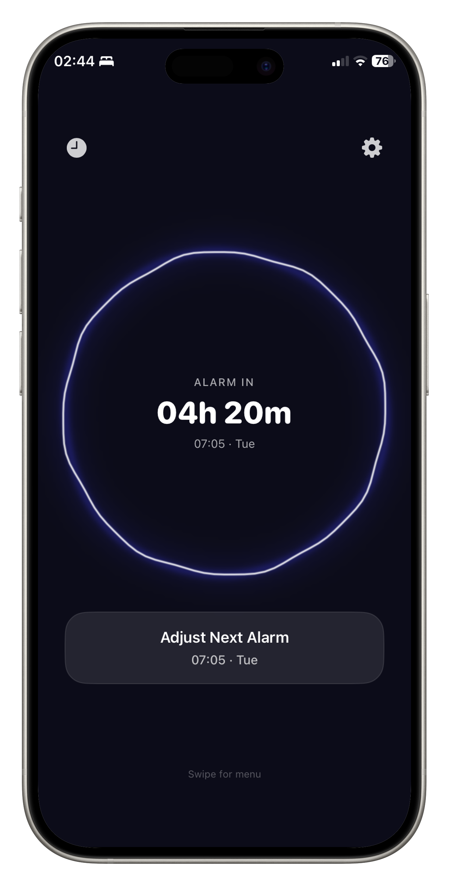

# Rouse (Talking Alarm)

iOS alarm clock for heavy sleepers. Instead of a dismiss button, you have to hold a voice conversation with an AI that asks you questions, escalates if you mumble or stall, and verifies you are actually awake before it lets you go. Built because nothing else gets me out of bed.



## Stack

Swift, SwiftUI, SwiftData, AlarmKit, ActivityKit on the device. Node.js, Fastify, BullMQ, Redis on the backend. OpenAI GPT-4o-mini for dialogue. ElevenLabs for voice. Next.js for the landing page.

## Why it exists

Normal alarms do not work on heavy sleepers. I can snooze for an hour without remembering it. The problem is not volume, it is that a button press is a reflex that bypasses your brain entirely. So Rouse forces three things instead. A long runway so the wake feels gradual. Forced cognitive engagement, because you cannot dismiss the alarm without speaking and reasoning. And actual verification, because mumbling resets the challenge.

The whole product is the engineering answer to "what would it take to make my brain wake up before my hand does".

## Architecture

Two services. iOS client and a Node backend.

### iOS client (`Talking_Alarm/`)

SwiftUI for the UI with feature-based modular structure. SwiftData for persistence. AlarmKit and ActivityKit for the system alarm and Live Activities, because nothing else can ring through Do Not Disturb reliably. A custom `VoiceProcessor` and `CircularSoundVisualizer` handle real-time audio analysis, so the UI reacts to both the AI voice and yours. State management uses modern Swift concurrency and `@Observable`.

### Backend (`talking-alarm-backend/`)

Fastify for the HTTP layer because it is fast to start, has good schema validation, and gets out of the way. BullMQ on top of Redis for job queues, because a GPT-4o-mini call plus an ElevenLabs synth call can take five to ten seconds and the iOS client often goes to background mid conversation. Synchronous request and response would be the wrong shape for this. With a queue the app submits, can sleep, and picks up the next turn when it is ready.

Long polling instead of websockets for the client wakeups, because the iOS client is usually backgrounded and websocket lifecycles get ugly across app suspensions. Long polling is boring and works.

### Landing page (`landing-page/`)

Next.js static export. Minimal. It exists so the App Store listing has a marketing page and the privacy and support links live somewhere.

## Design decisions

A few choices that were deliberate, not default.

**BullMQ over async/await.** Conversation turns are slow and the user often backgrounds the app mid turn. A queue lets the worker grind while the UI is dead, and the client picks up state when it comes back. Doing this with raw promises would have meant inventing my own retry, durability, and resume logic.

**GPT-4o-mini, not GPT-4o.** The dialogue does not need a frontier model. It needs personality, low latency, and consistent character voice. 4o-mini hit all three at a fraction of the cost, which matters when every alarm fires three to ten LLM calls.

**Voice verification on device, not in cloud.** Audio for wake verification is processed locally where possible. No audio is stored permanently. Partly a privacy decision, partly a latency one. A remote check on a wake mumble would be too slow to feel responsive.

**Escalation as a backend concern, not a client one.** The decision to escalate (gentler voice to drill sergeant) lives in the backend conversation state, not in the client. The client renders. The backend decides. That keeps the escalation logic in one place and lets me tune it without shipping an app update.

## Project structure

```
Talking_Alarm/          iOS source
  App/                  Entry point and navigation
  Features/             Alarm, Conversation, Home, Settings modules
  Services/             TTS, STT, Backend networking
  Config/               Prompts, voices, behaviour
talking-alarm-backend/  Node backend (Fastify + BullMQ + Redis)
landing-page/           Next.js marketing site
```

## License

Source available for reference. Not licensed for redistribution or commercial use.
